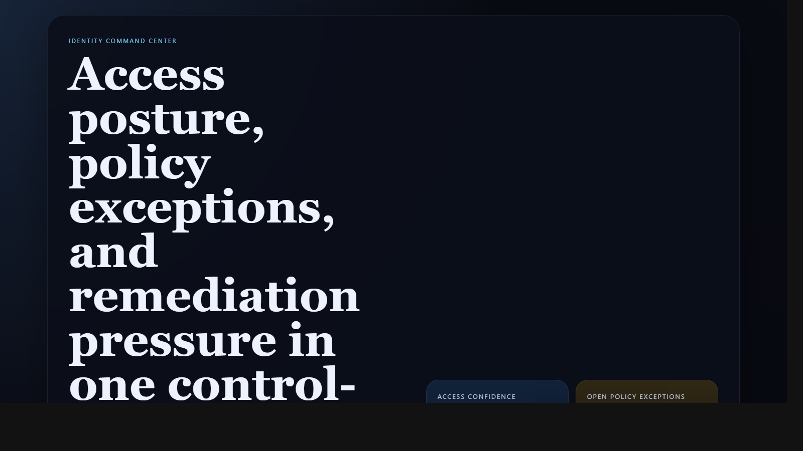
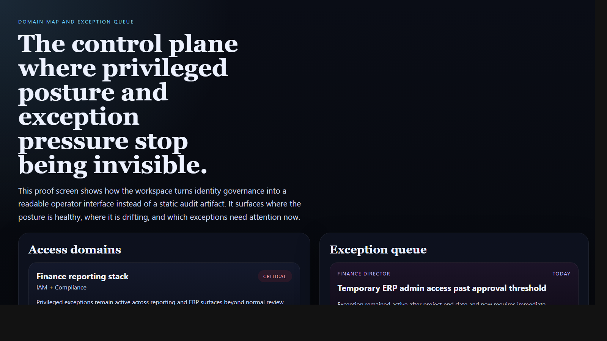
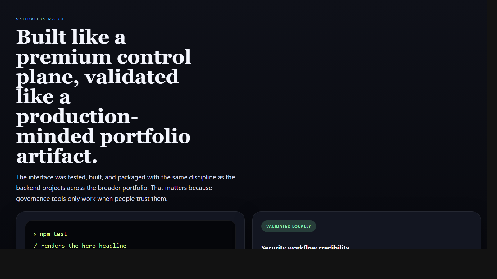

# Identity Command Center

> **React + TypeScript portfolio project** demonstrating identity governance, privileged-access posture, policy-exception workflows, and frontend systems design for enterprise control-plane tooling.

**Recruiter takeaway:** *"This person can make security governance feel like a real product, not just a pile of audit findings."*

---

## Project Overview

| Attribute | Detail |
|---|---|
| **Frontend Stack** | React 19 + Vite + TypeScript |
| **Domain** | Identity governance, access posture, exception workflows |
| **Audience** | IAM, compliance, security leadership, platform teams |
| **Signal Areas** | Privilege exposure · policy exceptions · remediation velocity · review completion |
| **Portfolio Role** | Frontend proof of security/control-plane product design |
| **Validation** | Vitest + Testing Library |

---

## Executive Summary

Identity Command Center is a recruiter-ready frontend project built to feel like a real internal control-plane workspace. Instead of showing flat audit tables, it makes access posture, privileged exposure, exception queues, and remediation movement visible in one interface that leadership and operators can actually use.

It is designed to show that security tooling can be both operationally serious and product-minded.

---

## Business Problem

Identity governance often becomes a documentation problem instead of an operating system. Findings live in spreadsheets, exceptions age out of view, and remediation lacks a clear product surface. Teams need a workspace that shows which domains are healthy, which exceptions are drifting, and what action is required now.

---

## Solution

This workspace turns identity governance into a coordinated frontend surface for:

- access-domain posture
- policy-exception queues
- remediation tracking
- executive-readable security posture
- premium control-plane UX

---

## Architecture

```text
Identity signals and exception data
    |
    v
Static TypeScript data model
    |
    v
React control-plane shell
    |
    +--> security posture cards
    +--> access domain map
    +--> exception queue
    +--> remediation tracks
    +--> proof and positioning layer
```

### Workspace Flow

1. Leadership and operators land on one posture view.
2. Access domains expose where privileged access is stable, drifting, or critical.
3. The exception queue shows which items require immediate ownership.
4. Remediation tracks make movement visible instead of burying action inside findings.
5. The proof layer reinforces why the repo matters as portfolio evidence.

---

## Screenshots

### Hero Capture



### Domain Map and Exception Queue



### Validation Proof



---

## Key Design Decisions

| Decision | Rationale |
|---|---|
| **Control-plane framing** | Makes the repo feel like real security infrastructure, not a static admin page |
| **Exception and remediation emphasis** | Focuses the interface on operator action instead of passive reporting |
| **Static demo data** | Keeps the project easy to run while preserving strong portfolio storytelling |
| **Distinct identity theme** | Gives the repo its own memorable visual character inside the broader portfolio |
| **Security posture first** | Surfaces the signals leadership and IAM teams care about most |

---

## What An Engineering Leader Sees Here

- frontend execution grounded in security workflow reality
- product design that supports identity governance and remediation work
- control-plane UX thinking instead of generic component assembly
- portfolio breadth across security, platform, commercial, and executive systems

---

## Getting Started

### Prerequisites

- Node.js 20+
- npm

### Setup

```bash
git clone https://github.com/mizcausevic-dev/identity-command-center.git
cd identity-command-center
npm install
cp .env.example .env
npm run dev
```

Open:

- `http://localhost:5173`

### Run Tests

```bash
npm test
```

### Build

```bash
npm run build
```

---

## What This Demonstrates

- security-governance frontend systems design
- identity and exception workflow understanding
- privileged-access posture translated into product structure
- React + TypeScript execution with tests and production-minded repo hygiene
- portfolio depth beyond revenue and operations alone

---

## Future Enhancements

- evidence drilldowns and review timelines
- risk history and trend views
- policy ownership workflows
- real export and audit package generation
- integration with ticketing and identity-provider workflows

---

## Tech Stack

[](https://react.dev/)
[](https://vite.dev/)
[](https://www.typescriptlang.org/)
[](https://developer.mozilla.org/en-US/docs/Web/CSS)
[](https://vitest.dev/)
[](https://opensource.org/license/mit)

### Portfolio Links

- [LinkedIn](https://www.linkedin.com/in/mirzacausevic)
- [Skills Page](https://mizcausevic.com/skills/)
- [Medium](https://medium.com/@mizcausevic)
- [GitHub](https://github.com/mizcausevic-dev)

---

*Part of [mizcausevic-dev's GitHub portfolio](https://github.com/mizcausevic-dev) — demonstrating security-workflow product thinking, frontend systems design, and operator-ready identity governance interfaces.*
